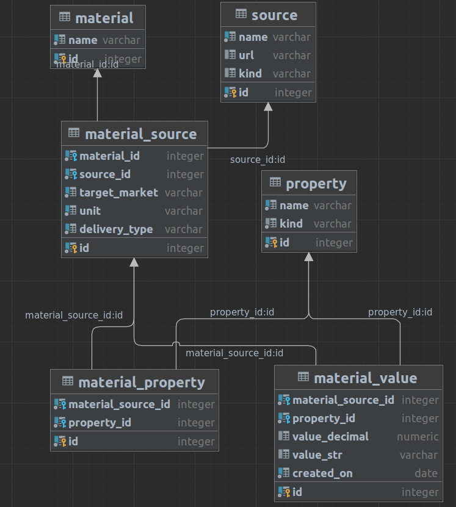

# Deploy

Copy deploy folder to server

    scp ~/deploy mp:.

Deploy required service/app

    ssh mp bash ./deploy/app.sh
    ssh mp bash ./deploy/chart.sh
    ssh mp bash ./deploy/docx.sh
    ssh mp bash ./deploy/frontend.sh

# DB Structure


# Request examples
```bash
GET localhost:8080/getValueForPeriod
Content-Type: application/json

{
  "material_source_id": 70,
  "property_id": 3,
  "start": "2023-01-01",
  "finish": "2023-01-01"
}

###
GET localhost:8080/getMonthlyAvgFeed
Content-Type: application/json

{
  "material_source_id": 3,
" property_id": 1,
  "start": "2021-10-01",
  "finish": "2022-07-01"
}

###
POST localhost:8080/getNLastValues
Content-Type: application/json

{
  "material_source_id": 1,
  "property_id": 1,
  "n_values": 2,
  "finish": "2022-12-13"
}

###
GET http://localhost:8080/getMaterialInfo
Content-Type: application/json

{
  "id": 82
}

###
GET localhost:8080/getMaterialList
Content-Type: application/json

{}

###
GET localhost:8080/getPropertyList
Content-Type: application/json

{
  "material_source_id": "2"
}

### Intit filling DB from Excel file
GET localhost:8080/initImport
Content-Type: application/json

{}


###
POST localhost:8080/addUniqueMaterial
Content-Type: application/json

{
  "name": "53",
  "source": "website.com",
  "market": "Test Market",
  "unit": "Test Unit"
}
###
POST localhost:8080/addValue
Content-Type: application/json

{
  "material_source_id": 1,
  "property_name": "med_price",
  "value_float": "100",
  "value_str": "",
  "created_on": "2025-10-14"
}

### Any day of target week
GET http://localhost:8080/getReport/weekly/2022-12-13

### Any day of target month
GET http://localhost:8080/getReport/monthly/2023-01-03

###
GET localhost:8080/getPropertyName
Content-Type: application/json

{
  "property_id": 1
}

###
GET localhost:8080/addPropertyToMaterial
Content-Type: application/json

{
  "material_id": 2,
  "property_name": "prop",
  "kind": "decimal"
}

```

# Adding user
```postgresql
INSERT INTO "user" (username, password) VALUES (
  'username',
  crypt('pwd', gen_salt('bf'))
);
```

# Internal server
There is also an internal server with same endpoints to handle internal needs