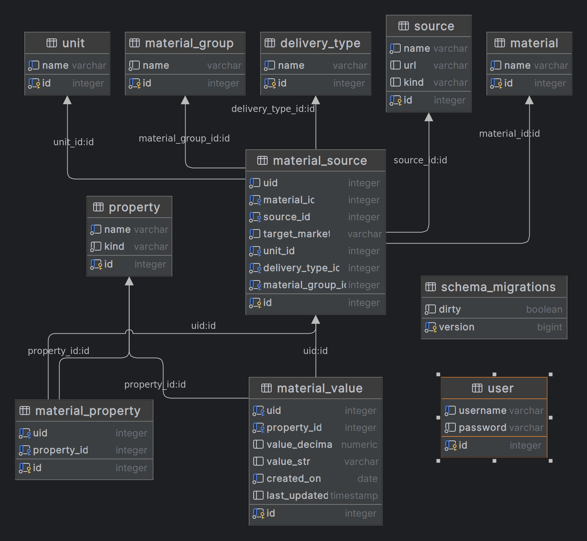

# Deploy

Copy deploy folder to server

    scp ~/deploy mp:.

Deploy required service/app

    ssh mp bash ./deploy/app.sh
    ssh mp bash ./deploy/chart.sh
    ssh mp bash ./deploy/docx.sh
    ssh mp bash ./deploy/frontend.sh

# DB Structure

# API
http://base.metallplace.ru:8080/swagger/index.html

# Internal server
There is also an internal server with same endpoints to handle internal needs