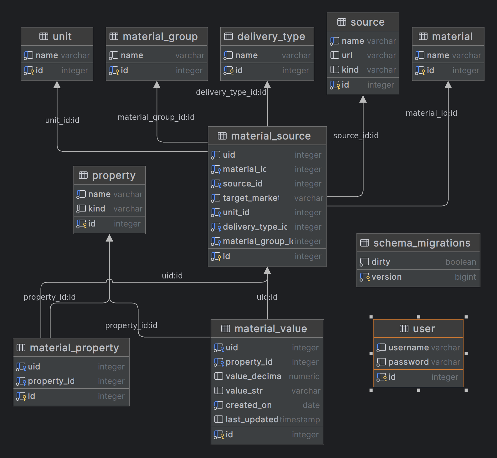

# Legacy Project Issues And Architectural Mistakes

This section captures the current architecture and code quality issues observed in the project. It is intentionally direct and should be treated as a baseline for future refactoring.

## 1. Hidden database dependency through request context

**Files:**

- `cmd/metallplace/main.go`
- `pkg/gopkg-db/context.go`
- all files in `internal/app/repository/*.go`

**Problem:**
The database client is stored in request context and later extracted inside repository methods through `db.FromContext(ctx)`.

**Why it is bad:**

- Hides a core infrastructure dependency instead of making it explicit
- Repository method signatures are dishonest about what they need
- Correctness depends on middleware/context wiring
- Missing DB in context causes a panic
- Turns `context.Context` into a service locator

**Example (`pkg/gopkg-db/context.go`):**

```go
func FromContext(ctx context.Context) IClient {
    conn, ok := ctx.Value(ctxName).(IClient)
    if !ok {
        panic("Not found db in context")
    }
    return conn
}
```

## 2. Global DB connection used as ambient shared dependency

**Files:**

- `cmd/metallplace/main.go`

**Problem:**
A package-level variable is used to hold the DB connection:

```go
var conn db.IClient
```

and then injected into requests by middleware.

**Why it is bad:**

- Introduces hidden global state
- Makes dependency flow harder to understand and test
- Couples request processing to ambient mutable infrastructure

## 3. Database injection implemented as middleware

**Files:**

- `cmd/metallplace/main.go`
- `pkg/gopkg-db/interceptor/interceptor.go`

**Problem:**
Middleware is used to insert the DB into context for downstream code.

**Why it is bad:**

- Middleware should handle transport/request concerns, not core DI
- The HTTP layer compensates for repository design flaws
- Persistence access becomes coupled to request pipeline mechanics

**Example (`cmd/metallplace/main.go`):**

```go
func DbMiddleware(next http.HandlerFunc) http.HandlerFunc {
    return func(w http.ResponseWriter, r *http.Request) {
        ctx := r.Context()
        r = r.WithContext(db.AddToContext(ctx, conn))
        next.ServeHTTP(w, r)
    }
}
```

## 4. Repository object is an empty shell

**Files:**

- `internal/app/repository/repository.go`

**Problem:**
The repository struct owns no state:

```go
type Repository struct{}
```

yet methods are attached to it as if it were a real dependency holder.

**Why it is bad:**

- Receiver is mostly decorative
- Repository does not actually own DB access
- Creates OOP-style ceremony without explicit ownership
- Encourages hidden dependency patterns

## 5. Giant repository abstraction with all persistence mixed together

**Files:**

- `internal/app/repository/material.go`
- `internal/app/repository/material_property.go`
- `internal/app/repository/material_source.go`
- `internal/app/repository/material_value.go`
- `internal/app/repository/property.go`
- `internal/app/repository/source.go`
- `internal/app/repository/group.go`
- `internal/app/repository/unit.go`
- `internal/app/repository/delivery_type.go`
- `internal/app/repository/check_credintials.go`
- `internal/app/repository/get_last_modified.go`
- `internal/app/repository/get_n_last_values.go`

**Problem:**
All persistence concerns are grouped under one repository object.

**Why it is bad:**

- Blurs domain boundaries
- Makes the repository conceptually huge
- Encourages god-object growth
- File-per-method layout gives false sense of modularity

## 6. Monster interface for repository layer

**Files:**

- `internal/app/service/service.go`

**Problem:**
`IRepository` contains a huge number of unrelated methods: materials, properties, sources, groups, units, delivery types, auth checks, timestamps, and values.

**Why it is bad:**

- Interface is too broad to be meaningful
- Reduces value of abstraction
- Makes all services depend on the entire persistence surface
- Violates Go's usual preference for small consumer-driven interfaces

## 7. Giant service object acting as application blob

**Files:**

- `internal/app/service/service.go`
- `internal/app/service/*.go`

**Problem:**
One `Service` owns config, repository, chart client, docx client, and mutable runtime state while exposing many unrelated methods.

**Why it is bad:**

- Centralizes unrelated responsibilities
- Becomes a dumping ground for new functionality
- Makes service boundaries meaningless
- Prevents honest domain separation

## 8. Mutable shared runtime state stored on service singleton

**Files:**

- `internal/app/service/service.go`
- All `internal/app/service/check_changes.go` and related callers
- `cmd/metallplace/main.go`

**Problem:**
`Service` stores `lastRequestTime time.Time` and exposes getter/setter methods.

**Why it is bad:**

- Service is constructed once and reused across requests
- Shared mutable state on root service is unsafe unless synchronized
- Request/operation-specific state does not belong on long-lived singleton-like service objects

## 9. Middleware logic placed inside service layer

**Files:**

- `internal/app/service/service.go`
- `cmd/metallplace/main.go`

**Problem:**
The service interface exposes:

```go
Authenticate(next http.HandlerFunc) http.HandlerFunc
```

**Why it is bad:**

- Service layer depends on HTTP transport types
- Middleware responsibilities leak into application service
- Breaks normal flow of server -> router -> middleware -> handler -> service -> repo
- Makes the service object both app layer and transport layer

## 10. Monster service interface for handlers

**Files:**

- `internal/app/handler/handler.go`

**Problem:**
`IService` includes a huge range of unrelated methods: imports, parsing, chart generation, reports, auth, JWT work, request-time tracking, and unit/delivery/property/material operations.

**Why it is bad:**

- Handler depends on "everything the app can do"
- Interface no longer expresses a clean boundary
- Reinforces god-service design
- Makes handlers depend on a universal blob instead of specific capabilities

## 11. File splitting used to simulate modularity

**Files:**

- `internal/app/service/*.go`
- `internal/app/repository/*.go`
- `internal/app/handler/*.go`

**Problem:**
Large central types are split into many files, but the real design units remain giant single structs/interfaces.

**Why it is bad:**

- Improves folder appearance without improving architecture
- Gives false impression of modularity
- Increases navigation overhead without creating real boundaries

## 12. Config loader panics internally and logs entire config

**Files:**

- `internal/pkg/config/config.go`

**Problems:**

1. `LoadConfig()` panics on `.env` failure.
2. Full config struct is logged.

**Why it is bad:**

- Function signature suggests normal error handling but may panic internally
- Startup behavior is inconsistent
- Logging full config can expose sensitive values
- Local `.env` assumptions are hardcoded into app startup

## 13. Migrations hidden inside DB constructor

**Files:**

- `pkg/gopkg-db/db.go`
- `pkg/gopkg-db/migrator/migrator.go`

**Problem:**
Creating the DB pool also automatically runs migrations.

**Why it is bad:**

- Couples DB connection setup with schema migration side effects
- Makes startup behavior less explicit
- Reduces operational flexibility
- Harder to reuse DB constructor in contexts where migrations should not run

## 14. Shared DB package became an architecture framework blob

**Files:**

- `pkg/gopkg-db/context.go`
- `pkg/gopkg-db/db.go`
- `pkg/gopkg-db/wrapper.go`
- `pkg/gopkg-db/interceptor/interceptor.go`
- `pkg/gopkg-db/migrator/migrator.go`
- `pkg/gopkg-db/option.go`

**Problem:**
A single shared package defines DB wrapping, transaction behavior, context storage, middleware/interceptors, migrations, and options.

**Why it is bad:**

- Too many responsibilities in one infra package
- App architecture becomes shaped by helper package internals
- Hard to reason about ownership and boundaries

## 15. Pool and transaction forced into one distorted interface

**Files:**

- `pkg/gopkg-db/wrapper.go`

**Problem:**
`IClient` includes methods that do not make sense for both implementations (`Commit`, `Rollback`). For `DBPool` they are implemented as no-ops returning `nil`.

**Why it is bad:**

- Interface is shaped around implementation convenience, not meaning
- Pool pretends to support transaction lifecycle methods
- Creates misleading abstraction

## 16. Transaction handling based on context rebinding of DB client

**Files:**

- `pkg/gopkg-db/db.go`

**Problem:**
`ExecTx` starts a transaction, wraps it, re-inserts it into context, and repository methods transparently switch behavior based on context contents.

**Why it is bad:**

- Transaction behavior is ambient and implicit
- Core execution mode changes are hidden in context
- Harder to reason about than explicit ownership of executor/transaction

## 17. Route definitions duplicated for internal and external servers

**Files:**

- `cmd/metallplace/main.go`

**Problem:**
Most routes are declared twice: once for external server and once for internal server.

**Why it is bad:**

- Maintenance duplication
- Route drift risk
- Security/auth differences become easier to get wrong
- Adding endpoints requires editing multiple large lists

## 18. `main.go` acts as a god bootstrap file

**Files:**

- `cmd/metallplace/main.go`

**Problem:**
`main.go` handles config, logger, DB creation, migration side effects, service wiring, handler wiring, route registration, auth wrapping, middleware assembly, sentry, CORS, internal/external server lifecycle, and signal handling.

**Why it is bad:**

- Composition root is overloaded with policy and duplication
- Harder to test and maintain
- Startup code is mixed with transport concerns and workaround logic

## 19. Weak lifecycle/error semantics around server shutdown

**Files:**

- `cmd/metallplace/main.go`

**Problem:**
Normal shutdown is turned into an error-like flow (for example, returning `fmt.Errorf("termination")`) and final error handling loses useful detail.

**Why it is bad:**

- Graceful shutdown and actual failure are not cleanly separated
- Operational diagnostics are worse than they should be

## 20. Generic handler helper uses reflection tricks to force one flow

**Files:**

- `internal/app/handler/handler.go`

**Problem:**
`handle[REQ, RESP]` uses generic request/response handling with reflection-based `isNil`.

**Why it is questionable:**

- Introduces reflection to compensate for abstraction awkwardness
- Forces a one-size-fits-all handler flow
- Less direct than explicit request decoding per endpoint

This is not the worst issue, but it matches the broader pattern of over-generalizing too early.

## 21. Low-level DOCX generation approach caused malformed or bloated output

**Files:**

- `docx-gen/*` (JavaScript)

**Problem:**
Report generation was implemented at a very low abstraction level using Node/docx primitives close to raw structure, instead of templates/placeholders or a higher-level report approach.

**Why it is bad:**

- Extremely brittle
- Easy to generate invalid or bloated DOCX
- Hard to maintain when report layout changes
- Wrong abstraction level for document/report generation

## 22. Chart request contract is overloaded and URL-encoded in the API layer

**Files:**

- `internal/app/handler/get_chart.go`
- `internal/app/model/chart_pack.go`
- `pkg/chartclient/client.go`
- `chart_service/src/app.ts`

**Problem:**
The public chart endpoint encodes many chart parameters into a packed route segment (`/getChart/{specs}`), while the chart service itself expects a large structured JSON payload.

**Why it is bad:**

- Harder to test and reason about
- Increases transport-level fragility
- Encourages ad-hoc request contracts across layers

# Deploy

Copy deploy folder to server

    scp ~/deploy mp:.

Deploy required service/app

    ssh mp bash ./deploy/app.sh
    ssh mp bash ./deploy/chart.sh
    ssh mp bash ./deploy/docx.sh
    ssh mp bash ./deploy/frontend.sh

# DB Structure


# API
http://base.metallplace.ru:8080/swagger/index.html

# Internal server
There is also an internal server with same endpoints to handle internal needs